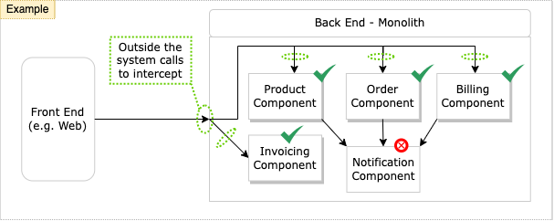

# Objectives

Modernizing legacy application is a journey of consistent and iterative takes rather than a big bang. Your modernization journey should adhere to following tenets:

- With minimal to no risk, quickly build confidence in your modernization approach (i.e. blueprint).
- Minimize disruptions to other developers working in parallel on the existing system.
- Continuously show incremental modernization gains with the flexibility to pause/stop modernization while retaining the investment.

In this module, you will learn about two modernization patterns - Strangler Fig and Branch by Abstraction - to help with your modernization journey.

> Anecdote: There is no silver bullet, perfect architecture, or perfect approach. Avoid analysis paralysis and move forward with trade-offs that work best for your organization.

 

## Common Problems to Solve

click to expand

Let's review common hurdles that Enterprises face on their modernization journey.

1. Where to start chipping away at the legacy application; identify specific component(s) to modernize first.

1. You may find yourself in conundrum: how to efficiently leverage in-house bandwidth to achieve balance across parallel tracks like:
    1. Continue to support ship features/bug fixes for your legacy application.
    2. Support both legacy and modernized code-bases: share common libraries, copy/fork the code, etc.
    3. Ensure the legacy and modernized versions continue to co-exist with minimal to no interruptions.

1. Additional hurdles to be mindful off (not covered here)
    1. Transition Authentication/Authorization from home grown solutions to a managed Identity Provider (e.g. Okta).
    1. Move database access towards modern object-relational mapper (ORM) frameworks like Entity Framework Core.

Sections below will provide suggestions to help solve these common problems.

 

## Modernization Baseline

click to expand

Following steps should be the starting point for any modernization approach.

1. Overall, follow the mantra to modernize legacy application in small increments (e.g. component by component).
    1. While modernizing, delay or freeze any functional or behavioral changes. Otherwise, you will have to accept that roll-backs would become harder.
    1. Duration of component modernization should be between few days to weeks. The longer it takes to modernize components, the more pressure/risk you may incur to allow behavioral changes into the legacy version of the component (e.g. bug fixes).

1. Start with the analysis of your legacy application (yes, captain obvious here!)
    1. Build out a dependency graph that shows 1/ breakdown of application's components (your services and 3rd party libraries) and 2/ relationships across components.
    1. Analyze portability of these components to .NET Standard 2.0 and .NET Core. Targeting .NET Standard 2.0 will help you share common libraries between your codebases .NET Framework and .NET (aka .NET Core).
    1. Identify component owners in your organization to 1/ validate your analysis and 2/ coordinate modernization effort and timelines.

    You can leverage no-cost tools like [AWS .NET Extractor](https://aws.amazon.com/microservice-extractor/) or [AWS .NET Porting Assistant](https://aws.amazon.com/porting-assistant-dotnet/).

    > FYI: .NET Framework 4.6.1 is the earliest version to support .NET Standard 2.0.

1. From the analysis graph tree, identify leafs as the starting point; component(s) with minimal incoming dependencies.
    1. You want the team to quickly build a modernization blueprint: 1/ gain confidence in porting approach (e.g. .NET Framework 4.7 -to- .NET LTS), 2/ stand-up necessary infrastructure, 3/ establish an observability approach for your distributed system, and 4/ build out the DevOps mechanisms to enable Continuous Integration (CI) and Continuous Deployment (CD).

1. Also, for first round of components selection, go after high business value. Modernization value should help ensure your company continues to invest in it.

1. Where possible, ring-fence the components to modernize by business domain (unit of function).
    1. Approaches like Domain Drive Design or Event Storming can help define the boundaries. These approaches do require time investment across SMEs working collaboratively: developers, architects, business SMEs, QA, and UX.

1. Strongly recommended: Adequate unit/integration test coverage to help validate the modernized components and include in your automation (CI).
    1. Adequate test coverage is a common challenge. In absence of test coverage, ensure to incorporate ample manual functional validation time in your modernization planning.

 

## Modernization Patterns

click to expand

Following is TL;DR for each pattern.

- **Strangler Fig** ([learn more](./modernization-patterns/1-strangler-fig-pattern.md))
  - Suitable to modernize component with minimal to no upstream dependencies.
  - Example

    

- **Branch by Abstraction** ([Learn More](./modernization-patterns/2-branch-by-abstraction.md))
  - Suitable to modernize component that are deeper in the call stack with upstream dependencies.
  - Example

    

 

## Modernization Tips

click to expand

1. Prior to modernization, ensure to discuss and adapt a development strategy that works best for your organization. Common approaches:

    1. Trunk based development with feature flags.
    1. Short lived feature branch.

    End goal is to avoid keeping your changes on an island for a long time and then deal with reconciliation pains; merging back to development/master.

1. If you’re still maintaining the ASP.NET app, it may be helpful to avoid static references to ConfigurationManager and replace them with access through interfaces. This will ease the transition to ASP.NET Core’s configuration system.

1. Logging: You can reference the Microsoft.Extensions.Logging package from .NET Framework apps as long as they’re using NuGet 4.3 or later and are on .NET Framework 4.6.1 or later. Once your app has referenced this package, you can convert your logging statements to use the new extensions before migrating the app to .NET Core.

 

## Appendix

click to expand

### Resources

- [Blog] - [Branch by abstraction pattern](https://continuousdelivery.com/2011/05/make-large-scale-changes-incrementally-with-branch-by-abstraction/)
- [Blog] - [Feature flag toggle approach - v1](https://martinfowler.com/articles/feature-toggles.html)
- [Blog] - [Feature flag toggle approach - v2](https://www.cloudbees.com/blog/future-of-feature-flags)

- Tools
  - Scientist.NET ([gitHub](https://github.com/scientistproject/Scientist.net)):
  A .NET Port of the *Scientist library* for carefully refactoring critical paths.

    > Use this tool only for code that does not have any side-effects.

