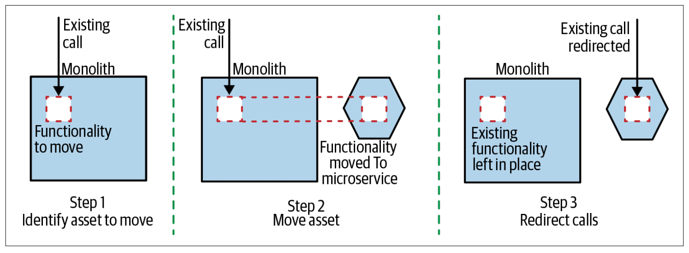
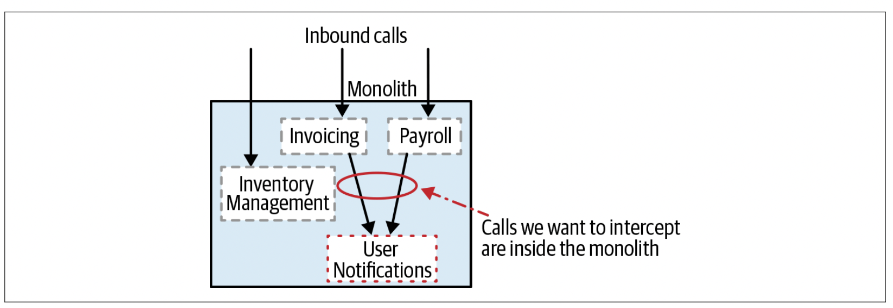

# Strangler Fig Pattern

## Pattern Concept

Commonly, Strangler Fig pattern is used to migrate from one monolithic system to another. You can use it to migrate from a monolith to modular service architecture.

Strangler Fig pattern involves three primary steps:

1. First, identify subset of the monolith components to modernize; ones with minimal to no incoming dependencies.
1. Second, perform the modernization: 1/ port the functionality as is or re-write it and 2/ validate the functional behavior.
1. Third, slowly reroute traffic for these components, from monolith to the modernized version.

  

## Pattern Benefits

- Without changing existing system, you can modernize components along side their monolith versions.
- Deploy modernized components to production, perform tests in-parallel to the existing system, and validate functional behavior.
- Finally, release the modernized components: redirect traffic for the components from monolith to the modernized version (e.g. via `HTTP Proxy`).

> **Deploy vs Release**: Deploy: only push to Production and validate its functionality. When ready to be consumed by the end user, we can release it (goes live).

Be mindful:

- The strangler Fig pattern doesn’t work too well when the component to be moved is deeper inside the existing system and it has upstream dependencies.
  - For these use cases, you can leverage another pattern called `Branch by Abstraction`.

    Example:
    

- While modernizing component, try to freeze functional or behavioral changes. Example, delay bug fixes or feature additions.
  - Allowing changes may make the rollback scenario much harder.

## Pattern Execution Steps

1. Ensure you've reviewed `Baseline` section in the [index.md](../index.md) file.

1. Incorporate `Gateway Proxy` to control traffic.

    1. If Proxy is new to the ecosystem, then simply integrate one with the existing system.
    1. This helps you 1/ assess impact of adding network hop and acceptable latency and 2/ ensure the system continues to operate as before.

      > [Tip] - Follow the mantra of “smart endpoints, dumb pipes". Avoid injecting business logic into proxy pipes (e.g. translate among protocol JSON-->gRPC); thus, converting this Proxy into yet another shared smart middleware pipe.

1. Iteratively modernize component's functionality
    1. Port its codebase from .NET to .NET Core, targeting Linux (ARM or x86).
    1. Reference common libraries via NuGet packages.
    1. As applicable, containerize the component (e.g. Docker).
    1. Validate against your unit/integration tests.

1. Deploy Modernized Component (not release yet!)

    1. Get the basic component deployed to production. For example, component shell w/out any functionality.
        a. You want to become comfortable deploying to Production through your CI/CD pipelines.
    1. Now, push component's functionality to production and validate that its working as expected.

1. Redirect Calls

    1. Following are some common approaches to direct traffic to the modernized component:
        1. Configure the HTTP Proxy to redirect calls to the modernized component.
        1. Use Feature flags.
        1. Or run it alongside the monolith to ensure its outputs matches the existing functionality.