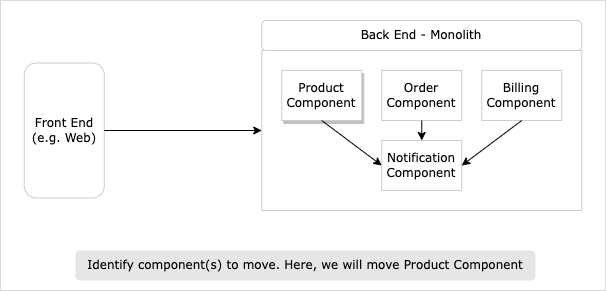
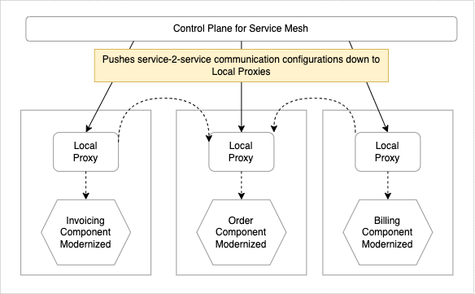
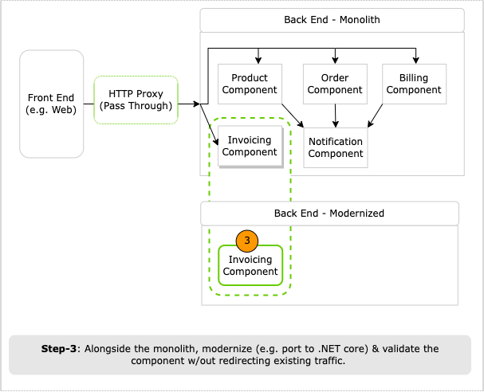
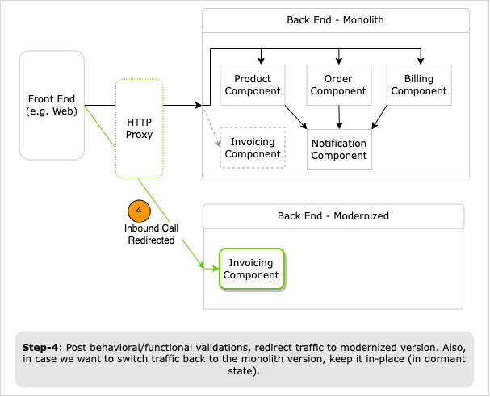

# Strangler Fig Pattern

## Pattern Origins (optional read)

click to expand

First captured by Martin Fowler [link](https://martinfowler.com/bliki/StranglerFigApplication.html), who was inspired by a certain type of fig that seeds itself in the upper branches of trees. The existing tree becomes initially a support structure for the new fig. The fig then descends toward the ground to take root, gradually enveloping the original tree, and leaving only the new self-supporting fig in its place.

 

## Overview

click to expand

Commonly used to incrementally replace a legacy system - component by component - with a modernized version. Goal is for legacy and new modernized versions to co-exist; new system initially be supported by, and wrapping, the existing system. This will give the new system time to grow and potentially entirely replace the old system.

For Strangler Fig pattern to work well: 1/ you need to be able to intercept outside the system calls at the perimeter of your monolith and 2/ easily redirect the inbound calls for functionality you care about to the asset that you want to move.

In the example diagram below, Strangler Fig pattern will work well for Product, Order, Billing, and Invoicing components. You can intercept and redirect outside the system inbound HTTP calls to their modernized version.

On the Contrary, Strangler Fig pattern would not work well for Notification component. Because notifications are fired as a result of multiple inbound calls to the legacy application. Therefore, you can’t clearly redirect the calls from outside the system itself. Another pattern called [Branch by Abstraction](./2-branch-by-abstraction.md) would work well (discussed later).

**How It Work (TL;DR)**

1. Identify component(s) to modernize first.
1. In parallel to the legacy application, create modernized component(s); as applicable, port or re-write.
1. Keep legacy version around (for rollback) and slowly start redirecting traffic to the modernized version.

> Tip: The more work you have to do in the proxy layer to understand and potentially redirect the inbound call, the less viable Strangler Fig pattern option may become.

 

## Pattern Benefits

click to expand

- Allows you to incrementally move functionality over to your modernized architecture without causing disruption to your legacy application.

- Without switching live traffic, you can deploy the modernized components to production, perform tests in-parallel to the existing system, and validate functional behavior.

- Incremental modernization gives you the ability to pause/stop while still taking advantage of the modernized system delivered so far.

> **Deployment vs Release**: Important to keep the deployment & release concepts separate. `Deployment`: Push to production and validate functional behavior. It's not live yet!
`Release`: When modernized component is ready, you can start directing user traffic to it.

**Be mindful:**

- While modernizing component, try to freeze functional or behavioral changes (e.g. bug fixes or feature additions).
  - Allowing changes may make the rollback - switch from modernized to legacy version - scenario much harder.

 

## Pattern Execution Walkthrough

click to expand

 Prior to steps below, ensure you've reviewed `Modernization Baseline` section in [index.md](../index.md).

1. Identify modernization candidate component(s). From sample legacy application depicted below, you will choose Invoicing component with no upstream dependencies.

    

1. Incorporate HTTP Proxy (e.g API Gateway) to intercept and direct outside the system calls (e.g. switch between monolith/modernized versions).

    1. If Proxy is new to the ecosystem, then integrate one, as simple pass through.
    1. Pass through approach will help you:
     - 1/ assess impact of adding network hop and acceptable latency
     - 2/ ensure the system continues to operate as before.

    

    **Be mindful**
    1. Follow the mantra of “smart endpoints and dumb pipes". You're optimizing for independent deployability of your services and converting this Proxy into yet another *shared* smart middleware pipe could slow down the process of making and deploying changes quickly.
    1. Where applicable, try to push any protocol translation into the service itself (e.g. JSON-->gRPC).
    1. Another alternative is service mesh: each service instance communicates with other service instances via its own, dedicated local proxy. Local proxy helps avoid creating a shared smart pipe and each service can own its own piece of the service-to-service pipe as needed.

        

1. Get a skeleton of modernized component up and running without any functionality being implemented.
    1. Component should accept calls made to the match the functionality but at this point you can return 501, Not Implemented.
    1. Optionally, you could get this component deployed to production. This will help you become comfortable with production push process through your CI/CD pipelines. Its not released yet (gone live).

1. Incrementally, modernize component's functionality. Example:
    1. Port or re-write component's functionality from .NET Framework to .NET Core, targeting Linux (ARM or x86).
    1. Reference common libraries via NuGet packages.
    1. Containerize the component (e.g. Docker).
    1. Iteratively start pushing it to production and validate that its working as expected.

    

    > [Tip] - While modernizing, ensure any functionality rewrites are small - doable over few days or weeks - and if needed, you could ship this reworked functionality to your customers regularly. If modernization timelines start to look more like several months, you should reexamine your approach.

1. Redirect Traffic

    1. Modernized component is fully built, tested, and deployed to production and serve user traffic.
    1. Configure your HTTP Proxy to redirect outside the system call to the modernized component.

        

    1. Other common approaches to control traffic:
        1. Use Feature flags.
        1. Canary deployment.
        1. Parallel run alongside the monolith to ensure its outputs matches the existing functionality.

