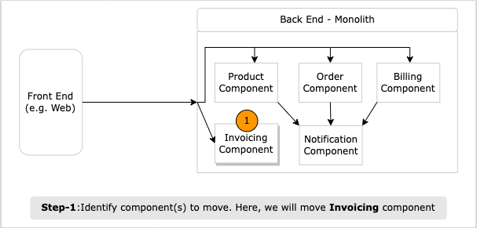
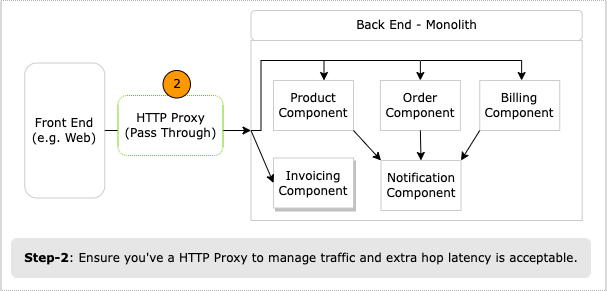
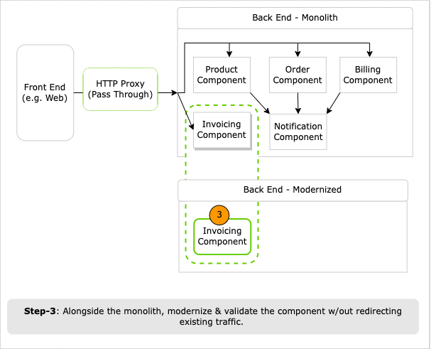

# Strangler Fig Pattern

Strangler Fig pattern is commonly used to incrementally replace a whole system (usually legacy) with a completely new one (modernized version).
It's best suited to modernize component with minimal to no upstream (i.e. incoming) dependencies.

TL;DR:

1. First, identify subset of the monolith components to modernize; ones with minimal to no upstream (i.e. incoming) dependencies.
1. Second, along side the monolith, perform the modernization: 1/ port or re-write the functionality and 2/ validate the functional behavior.
1. Third, slowly start to reroute respective traffic, from monolith to the modernized version.

## Pattern Benefits

- Without changing existing system, you can modernize components along side their monolith versions.
- Without service live traffic, you can deploy the modernized components to production, perform tests in-parallel to the existing system, and validate functional behavior.
- Finally, release the modernized components: redirect traffic for the components from monolith to the modernized version (e.g. via `HTTP Proxy`).

> **Deploy vs Release**: Deploy: only push to Production and validate functional behavior. When modernized component is ready to be consumed by the end user, you can release it (goes live).

**Be mindful:**

- To modernize components which exist deeper inside the existing system with upstream dependencies, [Branch by Abstraction](./2-branch-by-abstraction.md) is better pattern.

  Example: In sample application depicted below, you want to modernize Notification component.

  

- While modernizing component, try to freeze functional or behavioral changes (e.g. bug fixes or feature additions).
  - Allowing changes may make the rollback - switch from modernized to monolith version - scenario much harder.

## Pattern Execution Process

 Prior to steps below, ensure you've reviewed `Decomposed Monolith to Modular Services / Baseline` section in [index.md](../index.md).

1. Identify modernization candidate component. For the sample application depicted below, we will choose Product component with minimal to no incoming dependencies.

    

1. Incorporate `Gateway Proxy` to help control the incoming traffic (e.g. direct between monolith/modernized versions).

    1. If Proxy is new to the ecosystem, then integrate one; as simple pass through.
    1. This approach will help you with: 1/ assess impact of adding network hop and acceptable latency and 2/ ensure the system continues to operate as before.

    

    > [Tip] - Follow the mantra of “smart endpoints, dumb pipes". Avoid injecting business logic into proxy pipes (e.g. translate among protocol JSON-->gRPC); thus, converting this Proxy into yet another shared smart middleware pipe.

1. Iteratively modernize component's functionality. Example:
    1. Port its codebase from .NET to .NET Core, targeting Linux (ARM or x86).
    1. Reference common libraries via NuGet packages.
    1. As applicable, containerize the component (e.g. Docker).
    1. Validate against your unit/integration tests.

    

1. Deploy modernized component (not release yet!)

    1. Deploy the component to production. For example, component shell w/out any functionality.
        a. You want to become comfortable deploying to Production through your CI/CD pipelines.
    1. As you continue to build out the modernized component, you can iteratively start pushing it to production and validate that its working as expected.

1. Redirect Calls

    1. Modernized component is fully built, tested, and deployed to production and ready to go live!
    1. Following are some common approaches to direct traffic to the modernized component:
        1. Configure the HTTP Proxy to redirect calls to the modernized component.
        1. Use Feature flags.
        1. Or run it alongside the monolith to ensure its outputs matches the existing functionality.
  
    