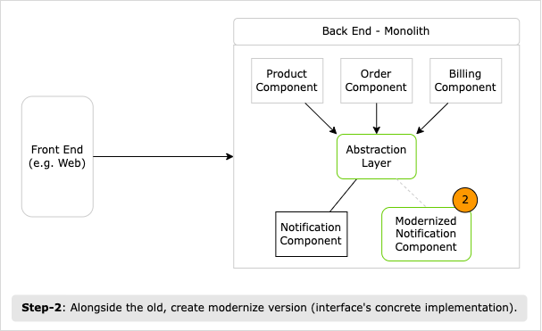
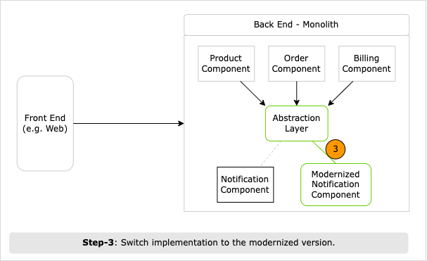

# Branch by Abstraction (i.e. Interface & Concrete Implementation)

Branch by Abstraction pattern is commonly used to modernize monolith components by breaking changes over multiple commits and avoid breaking the existing system.
It's best suited to modernize component with upstream (i.e. incoming) dependencies.

TL;DR:

1. First, identify monolith components with upstream dependencies.
1. Second, for this component: 1/ introduce abstraction and 2/ restructure existing system to use the abstraction.
1. Third, alongside the old, create new concrete implementation: either port to .NET Core or re-write it.
1. Fourth, switch traffic from old to new implementation.

## Pattern Benefits

1. Allows making changes in an incremental way while keeping the system running at all times. Enables continuous delivery.
1. Since the system keeps on working, you could choose to release a working version of the system containing a half-completed migration.
1. Release schedule is completely decoupled from your architectural changes, thus, you can stop working on the restructuring at any point to do something else that is higher priority.

## Pattern Execution Process

1. Create an abstraction layer (e.g. Interface in C#) on top of the component you plan to replace.
    1. Also, make the existing clients call the abstraction layer instead of the original component. This could happen in multiple commits.

    

1. Create new modernized version (i.e. concrete implementation of the abstraction layer).
    1. While modernized version being developed and tested, it continues to live along the existing implementation.

    

1. When ready, switch the abstraction's implementation to use the modernized version.

    

1. Rinse and repeat the previous steps, shipping your system in the meantime if desired.

1. Once the old implementation is ported into the modernized version, you could remove the old implementation.
    1. Also, if you want, you could remove the abstraction layer.

## Comparison vs Other Patterns

- Strangler Fig Pattern
  - Strangler Fig pattern operates at a higher level of abstraction than branch by abstraction, which is for incrementally changing the implementation of a component of your system.
  - Branch by Abstraction work better when the functionality to be moved is deeper inside the existing system.

    

- Feature Toggle
  - Both patterns that allow you to make changes to your system incrementally on mainline.
  - The difference is that feature toggles are intended to allow the development of new features, while keeping those features invisible to users when the system is running.
  - Branch by abstraction can of course be combined with feature toggles. For example, we can switch between old and new implementation.