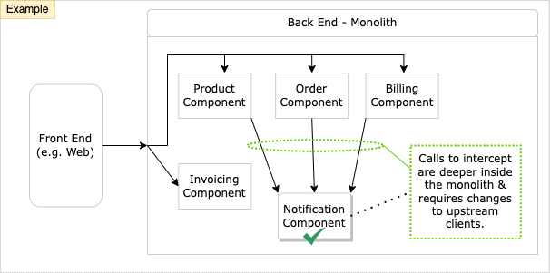

# Branch by Abstraction (i.e. Interface & Concrete Implementation)

This pattern is commonly used to modernize components that exists deeper in the monolith stack, with upstream dependencies (i.e. clients). This pattern relies on making changes to the existing codebase to allow the implementations to safely coexist alongside each other, in the same version of code, without causing too much disruption.

For example, using Strangler Fig pattern would require changes to upstream clients - changes to other parts of the codebase - which would be disruptive to other developers. 

In the example diagram below, Branch by Abstraction pattern will work well for Notification component.

**How It Works (TL;DR)**

1. Identify monolith components with upstream dependencies.
1. Create an abstraction layer for the component to be replaced and the system restructured to use this abstraction.
1. Alongside the old, create new implementation.
1. Switch over the abstraction to new implementation.

## Pattern Benefits

1. Allows making changes in small increments while keeping the system running at all times. Enables continuous delivery.
1. Since the system keeps on working, you could choose to release a working version of the system containing a half-completed modernization.
1. Release schedule is completely decoupled from your architectural changes. You can stop working on the restructuring at any point to do something else that is higher priority.

## Pattern Execution Process

1. Create an abstraction layer that represents the interactions between the code to be modernized and its clients (the callers of this code.). For example, in C#, create an Interface based on the existing functionality that you want to modernize.

    

1. With the abstraction in place, in small increments, you need to change the existing clients to use the new abstraction. This may require searching your codebase for calls being made to APIs related to the notification component.

    Diagram below shows incremental client update.

    

    Diagram below shows client updates completed.

    

1. Create new implementation of the abstraction.
    1. New implementation will likely exist outside your monolith, hosted under the modernized architecture. 
    1. Inside your monolith, you will have a client - acting as shell - calling out to the new implementation.
    1. Build incremental port of Notification functionality, new implementation can continue to stay dormant until tested and ready.

    Diagram below shows the process.

    

1. When ready, switch your abstraction over to use the new implementation.
    1. You would want to use a switching mechanism that can be toggled easily (e.g. Feature Toggle). In case of any problems, this allows you to quickly switch back to the old functionality.

    

1. When new implementation start to provide all Notification functionality to the users and monolith is no longer in use, you can clean up the older implementation.
    1. Also, remove any switching feature flag that you may have implemented. 

    

1. Optionally, you could remove the Abstraction layer (Interface).

1. Rinse and repeat the previous steps, shipping your system in the meantime if desired.

## Comparison vs Other Patterns

- Strangler Fig Pattern
  - Strangler Fig pattern operates at a higher level of abstraction than branch by abstraction, which is for incrementally changing the implementation of a component of your system.
  - Branch by Abstraction work better when the functionality to be moved is deeper inside the existing system.

    

- Feature Toggle
  - Both patterns that allow you to make changes to your system incrementally on mainline.
  - The difference is that feature toggles are intended to allow the development of new features, while keeping those features invisible to users when the system is running.
  - Branch by abstraction can of course be combined with feature toggles. For example, we can switch between old and new implementation.